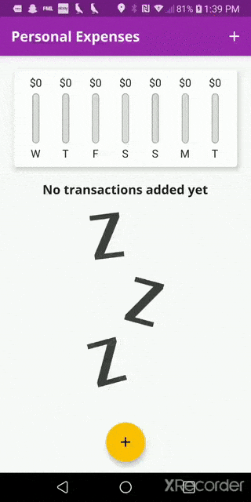

# expense_planner
This is an app that you can use to track the money you spent in a week.

I followed Adademind's Flutter tutorial to make this.

# How to Install
Open in Visual Studio Code, and run `flutter pub get` to get packages

Ctrl + F5 or `flutter run` to open the app on a real android/iphone device or a simulator.

# Preview

